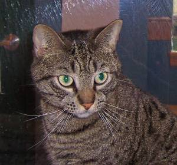
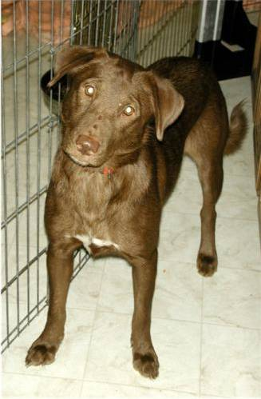

# Week 04 - CNN: классификация кошек, собак и гунганов

## 1. Задание от преподавателя
Реализовать сверточную нейронную сеть (CNN) для классификации изображений. Применить аугментацию данных, оценить модель на тестовой выборке, построить матрицу ошибок.

## 2. Концепт
Задача - трёхклассовая классификация изображений. В качестве третьего класса (помимо стандартных кошек и собак) используются гунганы - инопланетный вид из «Звёздных войн» (Джа Джа Бинкс). Это создаёт намеренный дисбаланс классов (кошки и собаки - тысячи изображений, гунганы - 41 штука), что требует применения весов классов и агрессивной аугментации.

## 3. Входные данные

| Кошка | Собака | Гунган |
|:-----:|:------:|:------:|
|  |  |  |

**Кошки и собаки:** архив `cat_dog_1.zip` (~8000 изображений на класс)  
**Гунганы:** 35 изображений, загружены заранее и сохранены локально в `gungans/` в формате JPEG (часть URL отдавала PNG несмотря на расширение `.jpg`, поэтому при загрузке используется PIL-конвертация через `.convert('RGB')`)

Структура после подготовки:
```
data/
  train/  cat/ (~8000)  dog/ (~8000)  gungan/ (~30)
  test/   cat/ (~2000)  dog/ (~2000)  gungan/ (~5)
```

Все изображения приводятся к размеру 128x128 пикселей. Для тренировочной выборки применяется аугментация: повороты ±20°, сдвиги, горизонтальное отражение, масштабирование, изменение яркости.

> **Дисбаланс классов:** кошки и собаки представлены ~8000 изображений каждый, гунганы - ~30. Соотношение примерно 270:1. Без компенсации модель полностью игнорирует класс `gungan`, так как предсказывая его всегда неправильно она теряет менее 0.4% accuracy. Для компенсации используются `class_weight='balanced'` (вес гунганов ~270x выше). Это улучшает recall по редкому классу, но может снизить общую accuracy по сравнению с обучением без весов.

## 4. Принцип работы модели

**Архитектура: Sequential CNN**

```
Input (128x128x3)
  -> Conv2D(32) + BatchNorm + MaxPool    # выделение низкоуровневых признаков
  -> Conv2D(64) + BatchNorm + MaxPool    # более сложные паттерны
  -> Conv2D(128) + BatchNorm + MaxPool + Dropout(0.3)
  -> Flatten
  -> Dense(256, relu) + Dropout(0.5)
  -> Dense(3, softmax)                   # вероятности 3 классов
```

**Пайплайн:**
1. `ImageDataGenerator` подаёт батчи с аугментацией из папок
2. Вычисляются веса классов (`compute_class_weight`) - класс `gungan` получает вес ~60x, чтобы компенсировать дефицит данных
3. Обучение с `EarlyStopping` (val_accuracy, patience=10) и `ReduceLROnPlateau`
4. Выход softmax: вектор из 3 вероятностей, предсказанный класс = `argmax`

## 5. Интерпретация результатов
- **Test accuracy** - доля правильно классифицированных изображений
- **Classification report** - precision/recall/F1 по каждому классу отдельно; для гунганов recall важнее precision из-за малого размера класса
- **Confusion matrix** - показывает, какие классы путаются друг с другом чаще всего
- **Sample predictions** - зелёный заголовок = правильно, красный = ошибка; уверенность модели показана как число от 0 до 1

## 6. Детали обучения

Модель обучена на облачном GPU через RunPod:

| Параметр | Значение |
|---|---|
| GPU | NVIDIA H100 80GB HBM3 |
| Скрипт | `train_fast.py` |
| Precision | mixed float16 (AMP) |
| Batch size | 512 |
| Optimizer | Adam (lr=1e-3) |
| Аугментация | на GPU (keras preprocessing layers) |
| Данные в памяти | весь датасет загружается в RAM один раз |
| Сохранение | `cat_dog_gungan_cnn.h5`, `training_history.json`, `model_meta.json` |

**Результаты обучения:**

| Класс | Precision | Recall | F1 |
|---|---|---|---|
| cat | 0.55 | 0.55 | 0.55 |
| dog | 0.55 | 0.54 | 0.55 |
| gungan | 0.00 | 0.00 | 0.00 |
| **overall accuracy** | | | **0.54** |

Гунганы получили 0% — модель их полностью игнорирует. Это ожидаемо: 32 обучающих примера против 2000 у кошек/собак. Даже с `class_weight=42x` модель не успевает обучиться на таком малом числе примеров. Этот результат наглядно демонстрирует проблему дисбаланса классов.

Early stopping: epoch 20 из 50 (best val_accuracy достигнута на epoch 10).

**Inference mode:** если `cat_dog_gungan_cnn.h5` лежит рядом с ноутбуком, все ячейки подготовки данных и обучения пропускаются автоматически — модель сразу загружается и переходит к оценке. Для принудительного переобучения установить `FORCE_TRAIN = True` в cell-2.

## 7. Использование готовой модели

Веса уже обучены и лежат в репозитории (`cat_dog_gungan_cnn.h5`). Чтобы запустить классификацию без переобучения:

**1. Клонировать репозиторий**
```bash
git clone https://github.com/redizga/spbstu-ml-week04-cnn.git
cd spbstu-ml-week04-cnn
```

**2. Установить зависимости**
```bash
pip install -r requirements.txt
```

**3. Открыть ноутбук**
```bash
jupyter notebook "Week 04 - CNN_3class_CatDogGungan.ipynb"
```

**4. Запустить все ячейки**

Ноутбук автоматически обнаружит файл `cat_dog_gungan_cnn.h5` и перейдёт в inference mode — подготовка датасета и обучение будут пропущены. Выполнятся только ячейки загрузки модели, оценки и визуализации.

> Убедиться что режим определился правильно можно в cell-2 — она выведет `Mode: INFERENCE`.

**Принудительное переобучение**

Если нужно переобучить модель с нуля, установить в cell-2:
```python
FORCE_TRAIN = True
```
Для этого потребуется распаковать датасет (`cat_dog_1.zip.part*` лежат в репо, ноутбук соберёт их автоматически).

## 8. Заключение
CNN с аугментацией и взвешиванием классов позволяет работать с сильно несбалансированными наборами данных. BatchNormalization ускоряет обучение и снижает чувствительность к learning rate. Без весов классов модель бы игнорировала гунганов, предсказывая их как кошек или собак в подавляющем большинстве случаев.
